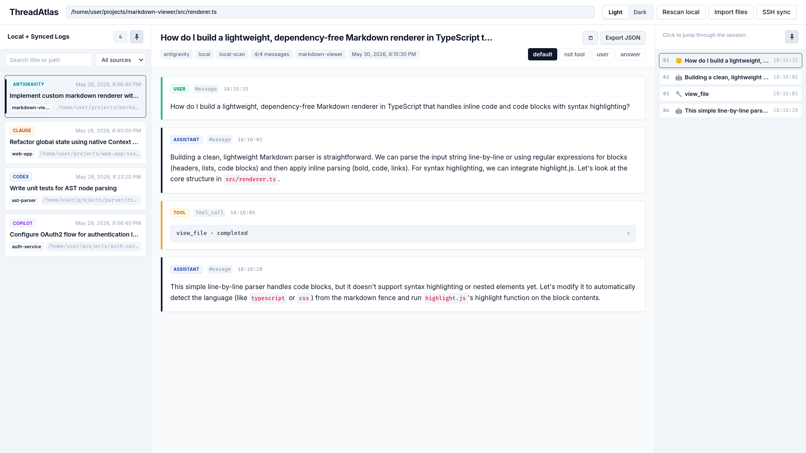
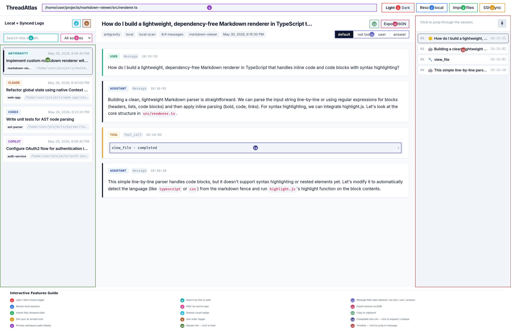

# ThreadAtlas

ThreadAtlas is a lightweight browser app for browsing AI coding sessions from local files, local machine scans, and SSH-synced remote mirrors.

It currently supports `codex`, `claude`, `opencode`, `gemini`, `antigravity`, and `copilot` session sources without adding a frontend framework runtime.





## Features

- **Tolerant Parsing & Mixed Sources**: Parses multiple raw formats (`codex`, `claude`, `opencode`, `gemini`, `antigravity`, `copilot`) into a standardized, unified `Session` model.
- **Local Scanning & Storage**: Runs a lightweight, request-scoped Express backend on `localhost:3030` for discovering and loading raw session bundles.
- **High-Fidelity Log Viewer**:
  - Dense log UI optimized for reading complex agent trajectories and transcripts.
  - Full support for **ANSI colored terminal outputs** and custom symbol fallback fonts in log rendering.
  - Interactive, **collapsible markdown code frame headers** to streamline code block visibility.
- **Fluid & Responsive Layout**:
  - Smooth **hover-expandable and auto-collapsing sidebar & timeline drawers** using premium ease-out-expo transitions, smart hover intent, and mouseleave buffers to maximize screen estate.
  - In-place sidebar and timeline pinning that dynamically adapts layout grids without jitter or unnecessary re-renders.
- **Smart Workspaces & Navigation**:
  - Displays primary **session workspace / CWD** next to the session path in the sidebar for quick context identification.
  - Jump-to-timeline navigation with instant scroll alignment.
- **State Persistence**: Remembers your preferred sidebar source filters and chat message filter selections across page reloads using `localStorage`.
- **Browser-Side Import**: Direct file imports parsed in-browser; imported logs are never uploaded to the backend.
- **Secure SSH Syncing**: Discovers and mirrors remote sessions into `data/remote/<user>@<host>/...` via password or private key SSH authentication.
- **Sleek Aesthetics**: Fully responsive layout with a beautiful, unified look and a smooth light/dark theme toggle.

## Supported Sources

- Codex CLI
- Claude Code
- OpenCode
- Gemini CLI
- Antigravity
- Copilot

### Local scan roots

- `~/.codex/sessions`
- `~/.claude/projects`
- `~/.gemini/tmp`
- `~/.gemini/antigravity/conversations`
- `~/.gemini/antigravity/brain`
- `~/.gemini/antigravity-cli`
- `~/.copilot/session-state`
- `~/.local/share/opencode/opencode.db`
- `data/remote/` for previously synced remote files

### Remote scan roots

- `~/.codex/sessions`
- `~/.claude/projects`
- `~/.gemini/tmp`
- `~/.gemini/antigravity/conversations`
- `~/.gemini/antigravity/brain`
- `~/.gemini/antigravity-cli`
- `~/.copilot/session-state`
- `~/.local/share/opencode/opencode.db`

### Import behavior

- Browser import remains text-file based and keeps files in the browser store only.
- Copilot `events.jsonl` can be imported directly as a standalone file, with optional metadata available when loaded through local scan.
- Antigravity `transcript_full.jsonl` files are preferred when present; raw `.pb` files are loaded through local scan or SSH sync as a fallback so the backend can decode them into generated `#chat.jsonl`.

## How It Works

- `GET /api/local/scan` returns session descriptors only
- `GET /api/local/session?key=...` returns one raw session bundle
- Antigravity is the one decode exception: the backend may unwrap `.pb` into a generated `#chat.jsonl` bundle
- Frontend parsers normalize raw bundle content into one `Session` model
- Imported browser files stay in the browser store and are not uploaded to the backend
- Remote sync only writes under `data/remote/<user>@<host>/...`

## Development

### Requirements

- Node.js with npm

### Install

```bash
npm install
```

### Run dev mode

```bash
npm run dev
```

Then open `http://localhost:5173`.

Vite serves the frontend on port `5173` and proxies `/api` requests to the Express backend on `localhost:3030`.

### Run production mode

To compile the application and start the Express production server (which runs on `localhost:3030` and serves the compiled frontend assets directly):

```bash
npm start
```

Then open `http://localhost:3030`.

#### Quick Launch Scripts
Alternatively, you can use the wrapper startup scripts, which will automatically verify and install dependencies (`npm install`) if needed before building and launching the server:

- **Linux/macOS**:
  ```bash
  chmod +x start.sh
  ./start.sh
  ```
- **Windows**: Double-click `start.bat` or run it from the command line:
  ```cmd
  start.bat
  ```

### Validate

```bash
npm run typecheck
npm run build
```

### Take a screenshot

To regenerate the application screenshot stored in `docs/screenshot.png` using a headless browser, run:

```bash
npm run screenshot
```

## Common Workflows

### Browse local sessions

1. Start the app with `npm run dev`.
2. Click `Rescan local`.
3. Filter by source or search by title/path.
4. Open a session from the sidebar.

### Import files from the browser

1. Click `Import files`.
2. Choose one or more local session files.
3. Browse them directly in the UI without uploading them to the server.

### Sync from a remote machine

1. Click `SSH sync`.
2. Fill in host and username, then authenticate with password or private key.
3. Run `Test connection` or `Scan remote`.
4. Select the remote session items you want.
5. Click `Sync selected`.
6. The downloaded files are stored under `data/remote/<user>@<host>/...` and appear in the normal local scan results.

Remote scan currently covers Codex, Claude, Gemini, Antigravity, Copilot, and OpenCode paths.
Copilot remote sync discovers session directories and downloads `events.jsonl` plus known sibling metadata files when present.

## Architecture

- `server/`: Express backend for local scan, bundle loading, SSH workflows, and static serving of `dist/`
- `src/parsers/`: source detection and tolerant adapters
- `src/store/`: in-memory application state
- `src/ui/`: framework-free DOM UI

## Notes

- The backend discovers files and returns raw bundles; semantic parsing stays in the frontend.
- Antigravity is the one transport exception: scan-backed `.pb` files are decoded server-side into generated chat JSONL before parsing.
- Copilot sessions are discovered as directories rooted at `events.jsonl`, with optional sibling metadata files bundled when available.
- SSH scan returns Copilot sessions as directory selections, while sync still downloads files into the local mirror before the normal scanner picks them up.
- Missing local directories are treated as empty results, not errors.
- OpenCode SQLite scanning is handled through the bundled Node dependency, not a system `sqlite3` command.
- Parser behavior is intentionally best-effort. Unknown or partial data should still render as a readable session when possible.
